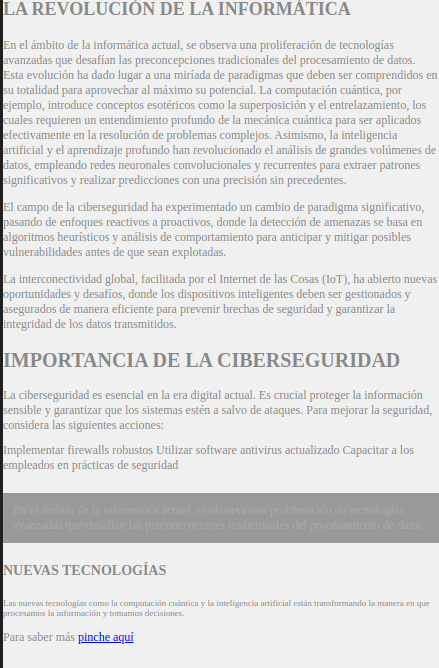

# Ejercicios de usabilidad
Como vemos en la imagen de abajo este es el HTML que no está bien en temas de diseño:

## Problemas
1. El primer problema hablamos del propio HTML, la estructura no es correcta, utiliza un `<h3>` como titulo seguido de un `<h2>` no es correcto esta estructuracion
2. utiliza la etiqueta `<style>` dentro de un parrafo
3. Ahora pasando al estilo, sus colores no tienen contraste con el fondo, no tienen buena legibilidad y no puede verse a primera vista de que quiere hablar esta página,
4. Parrafos completamente sin separacion, cuadros de textos ilegibles, y tamaños minisculos
5. Algo que deberia ser muy importante es el enlace donde pone piche aqui, no es atractivo y no inspira confianza para que nadie pinche ahí

## Soluciones
1. Seguir la estructura implementada por *`W3C`*, para que el **`SEO`** y las verificaciones de codigo sean mucho mejor
2. Cambiar las fuentes, tanto en tamaño como en color, para que sean mucho mas reconocibles a primera vista
3. Mantener un espaciado para tener en cuenta las ideas importantes
4. El enlace deberia ir abajo y un pequeño texto donde lleva para inspirar mas confiaza
